# Support Brain for SaaS — Lightweight Architecture Sketch

## 1. Architecture decision
The current recommendation is to use **Nanobot** as the **session layer (runtime shell)** for Cygnus, not as the product core.

One-line boundary:
- **Nanobot** owns how sessions happen
- **Cygnus** owns how support knowledge is governed, reviewed, published, and evaluated

This lets Cygnus reuse Nanobot's strengths in runtime, workbench, memory, MCP, and sustained sessions without collapsing the product into a generic agent shell.

## 2. Why session layer instead of product core
Cygnus still exists to be:
- a support knowledge operating system
- a system of support-native knowledge objects
- a review / publish / traceability engine
- an audience-aware retrieval and distribution layer

If Nanobot becomes the product core, the main risks are:
- the product center drifts into the chat window
- the domain object layer gets swallowed by a generic runtime
- review, publish, policy, and audience logic become secondary runtime features

So the healthier shape is:
**Nanobot in front, Cygnus at the center.**

## 3. Recommended layering

### Layer A — Session Layer (Nanobot)
Responsibilities:
- multi-turn sessions
- workbench / project workspace
- memory / sustained goals / session continuity
- multi-channel entry points
- model routing
- general tool-calling runtime
- lightweight planning persistence

Things it should not own:
- support knowledge object schema
- publish governance
- review policy
- audience policy
- business metrics truth

### Layer B — Domain Harness (Cygnus)
Responsibilities:
- support-domain typed tool registry
- permission / approval / audit enforcement
- source-of-truth context
- retrieval orchestration
- review queue / publish policy
- business-state validation
- eval signals and workflow traces

This is the real **control plane**.

### Layer C — Knowledge Core (Cygnus)
Responsibilities:
- Answer Card / Troubleshooting Flow / Policy Rule / Known Issue Page / Escalation Route / Audience Variant
- source ingest / evidence normalization
- object versioning
- publish records
- feedback signals
- coverage / drift model

### Where Arkon sits
Within this layered model, **Arkon should be understood as the underlying knowledge-system substrate inside Cygnus's knowledge and retrieval layers**, especially for:
- LLM-wiki style knowledge compilation
- source ingest / normalization patterns
- retrieval substrate implementation
- draft / review / publish mechanics

So Arkon does **not** sit in front of Cygnus as the product shell.
It sits **inside** the Cygnus knowledge layer as a foundational implementation base.

### Current migration strategy
This is where product boundary and engineering strategy must stay separate:

- **product boundary remains unchanged**: Cygnus is still the support knowledge operating system
- **engineering strategy has changed**: the current mainline is no longer `domain-first selective extraction`; it is now an **Arkon full-port baseline**

The current engineering order is:
1. first mirror **Arkon backend / runtime / worker / AI pipeline / retrieval / protocol** into Cygnus
2. preserve upstream topology as much as possible during import
3. then repair wiring / runability
4. if the goal is to fully absorb Arkon into Cygnus substrate, enter **P2.5 internalization / upstream cutover**
5. then execute Cygnus support-domain verticalization

This means:
- Arkon is still **internal substrate**, not the Cygnus product shell
- but Cygnus now first receives an **Arkon baseline codebase inside the repo**
- Arkon product-shell / admin-shell / non-support pages are not mandatory in the current lane

### Current code-boundary diagram (runtime / substrate / governance-domain)
The current code tree has already converged into an **intentional layered shape**. It should not be misread as “all backend packages must eventually be pushed back under `runtime/`.”

```mermaid
flowchart LR
    NB[Nanobot
Session Layer / Workbench / Memory]

    subgraph CYG[Cygnus]
      direction TB

      subgraph RT[cygnus.runtime
runtime shell / app shell / imported upstream topology]
        direction TB
        RT1[main.py / worker.py / config.py]
        RT2[routers / services / database / mcp / ai / utils / scripts]
      end

      subgraph GOV[Cygnus business and governance control plane
intentionally kept outside runtime]
        direction TB
        G1[domain
support knowledge objects]
        G2[evidence / retrieval
object + evidence retrieval]
        G3[review / publish / recovery
governance surfaces and state transitions]
        G4[integrations / workflows
external integrations and governance workflows]
      end

      subgraph SUB[cygnus.substrate
Cygnus-owned substrate contracts]
        direction TB
        S1[agent_protocol / tool_runtime]
        S2[pipeline_phases / pipeline_checkpoint]
        S3[durable_jobs / compilation_plan / providers]
      end
    end

    NB -->|tools / APIs / MCP| RT
    RT -->|assemble / expose| GOV
    RT -->|runtime wiring| SUB
    GOV -->|typed contracts / workflow primitives| SUB
```

The diagram should be read with these rules:
- `cygnus.runtime/*` is the **canonical runtime entry / imported shell**, not the only truth for the whole product backend
- `domain / evidence / retrieval / review / publish / recovery / integrations / workflows` staying outside `runtime` is **intentional**, not an unfinished migration
- `cygnus.substrate/*` is the **long-lived contract layer**, not a second app shell
- the source-compilation primitive cluster now explicitly frozen under `cygnus.substrate/*` includes:
  - `cygnus.substrate.source_outline`
  - `cygnus.substrate.source_images`
  - `cygnus.substrate.source_text`
  - `runtime` may call these primitives, but it no longer owns their extraction semantics
- the preferred dependency direction is: `Nanobot -> runtime -> governance/domain`, plus `governance/domain -> substrate`
- `governance/domain -> runtime` should not become a default reverse dependency; `runtime` assembles and exposes surfaces, but should not swallow all business semantics

This is also why the next refactor step should not be “push everything back into `runtime`” again. The better next cuts are:
- runtime adapter / router seam splitting
- fixture / sample-provider extraction
- continued convergence of owner wording and import policy

### Layer D — Workflow Orchestration (Cygnus)
If Cygnus ever needs internal workflow orchestration, it should serve only explicit governance flows, such as:
- knowledge object creation workflows
- freshness / drift refresh workflows
- publish governance workflows

In the current phase, do not pre-commit to an independent orchestration framework; prefer explicit services, typed tools, bounded mini-loops, and auditable state progression first.

It should not be used for:
- pure read-only copilot retrieval
- simple single-turn Q&A
- generic session continuity
- a second general chat runtime

### Layer E — Eval & Observability (Cygnus)
Responsibilities:
- retrieval evals
- workflow evals
- policy / approval correctness evals
- business KPI measurement
- token / latency / failure / reviewer-rejection traces

## 4. Nanobot–Cygnus interface pattern
Recommended relationship:
**Nanobot should consume Cygnus through stable tools, APIs, or MCP surfaces rather than reaching directly into business internals or the database.**

### Minimum capabilities to expose to Nanobot
#### Retrieval
- `search_knowledge_objects(query, audience_context)`
- `read_knowledge_object(id_or_slug)`
- `search_support_evidence(query, filters)`
- `get_source_trace(object_id)`

#### Draft / review
- `propose_knowledge_object(input)`
- `update_draft_object(draft_id, patch)`
- `request_review(draft_id)`
- `read_review_feedback(draft_id)`

#### Governance
- `validate_publish_policy(draft_id, target_channel)`
- `publish_knowledge_object(draft_id, target_channel)`
- `list_drift_alerts(filters)`
- `record_feedback_signal(signal)`

## 5. Where RAG belongs
RAG should not live primarily inside Nanobot as a generic retrieval plugin. It should primarily live inside the Cygnus knowledge core.

### Correct structure
- **Cygnus** maintains the object index and evidence index
- **Cygnus** owns metadata filtering, hybrid retrieval, reranking, and audience gating
- **Nanobot** accesses retrieval only via tools

### Why this matters
- prevents generic semantic search from replacing domain objects
- prevents audience policy from fragmenting across runtimes
- preserves traceability in the domain layer

## 6. Harness boundary
### Nanobot harness should own
- session state
- chat runtime
- tool-proposal loop
- connector attachment
- memory / workspace continuity

### Cygnus harness should own
- typed domain tools
- argument validation
- approval gating
- permission enforcement
- business invariants
- audit trail
- publish guardrails

Rule:
**The model may propose, but high-risk business decisions must be enforced inside the Cygnus domain harness, not only by the Nanobot runtime.**

## 7. Workflow orchestration placement rule
If Cygnus needs internal workflow orchestration, it should serve explicit business-governance flows rather than replace Nanobot's entire session runtime.

### Workflows worth orchestrating
1. **Knowledge Object Creation Workflow**  
   evidence / ticket cluster -> classify -> draft -> critic -> reviewer -> approval -> publish

2. **Freshness Refresh Workflow**  
   drift signal -> fetch object -> fetch new evidence -> propose revision -> verify -> republish

3. **Publish Governance Workflow**  
   ready draft -> audience validation -> visibility policy -> approval -> publish record

## 8. Eval boundary
### Session-layer evals (Nanobot-leaning)
- tool selection accuracy
- long-session continuity
- memory usefulness
- pause/resume correctness

### Domain-layer evals (Cygnus-leaning)
- retrieval relevance
- wrong-audience rate
- citation grounding
- object-type classification correctness
- approval correctness
- publish-policy correctness

### Business evals (north-star)
- human rewrite rate
- suggestion acceptance rate
- freshness SLA
- unsupported answer rate
- ticket-cluster-to-draft conversion rate

## 9. Recommended implementation order
### Engineering mainline
1. **P0 — Migration Manifest & Boundary Freeze**
2. **P1 — Arkon full-port source parity import**
3. **P2 — Repair / Runability Recovery**
4. **P2.5 — Arkon internalization / upstream cutover**
5. **P3 — Cygnus support verticalization**
6. **P4 — Optional product-shell parity (default: deferred / non-roadmap)**

### Product/runtime boundary line that still remains true
During P1/P2/P2.5, Cygnus still preserves:
1. Nanobot only as the session layer
2. RAG truth inside Cygnus
3. Internal workflow orchestration only for governance flows
4. support knowledge objects above generic wiki nouns

## 10. Current conclusion
Nanobot is a strong **Cygnus session-layer** candidate, but it should serve Cygnus rather than replace it.

The healthier shape is not:
- `Cygnus built inside Nanobot`
- `Cygnus = Arkon product-shell copy`

It is:
- `Nanobot as session shell`
- `Cygnus as domain control plane + knowledge core`
- `Arkon imported as the full-port backend substrate baseline`
- `Arkon internalized through a dedicated post-P2 cutover lane`
- `Workflow orchestration kept inside Cygnus governance flows`
- `RAG inside Cygnus retrieval layer`
- `Eval across both session and business layers`
