# Support Brain for SaaS — 轻量架构草图

## 1. 架构决策
当前建议将 **Nanobot** 作为 **Cygnus 的会话层（session layer / runtime shell）**，而不是把 Nanobot 当成整个产品内核。

一句话边界：
- **Nanobot** 负责“会话如何发生”
- **Cygnus** 负责“支持知识如何被治理、审核、发布、评估”

这能最大化复用 Nanobot 在 runtime / 会话 / workbench / memory / MCP 上的强项，同时避免产品核心退化成 generic agent shell。

## 2. 为什么是会话层，而不是产品核心
Cygnus 的产品本体仍然是：
- support knowledge operating system
- support-native knowledge objects
- review / publish / traceability
- audience-aware retrieval and distribution

如果把 Nanobot 放成产品核心，风险是：
- 产品中心漂移到聊天窗口
- 业务对象层被通用 agent runtime 吞掉
- review / publish / policy / audience 这些产品关键能力变成 runtime 上的附属逻辑

因此更合理的结构是：
**Nanobot in front, Cygnus at the center.**

## 3. 分层建议

### Layer A — Session Layer (Nanobot)
职责：
- 多轮会话
- workbench / project workspace
- memory / sustained goals / session continuity
- 多 channel 接入（chat UI / MCP / future channels）
- 模型路由
- 通用工具调用运行时
- 轻量计划与任务持续化

不应该主导的职责：
- 支持知识对象 schema
- 发布治理
- 审核策略
- audience policy
- business metrics truth

### Layer B — Domain Harness (Cygnus)
职责：
- tool registry（support-domain typed tools）
- permission / approval / audit enforcement
- source-of-truth context
- retrieval orchestration
- review queue / publish policy
- business-state validation
- eval signals and workflow traces

这是你的 **control plane**。

### Layer C — Knowledge Core (Cygnus)
职责：
- Answer Card / Troubleshooting Flow / Policy Rule / Known Issue Page / Escalation Route / Audience Variant
- source ingest / evidence normalization
- object versioning
- publish records
- feedback signals
- coverage / drift model

### Arkon 放在哪
在这套分层里，**Arkon 更准确地应被理解为 Cygnus 知识层 / 检索层内部的底层知识系统 substrate**，尤其承载：
- LLM-wiki 风格的知识编译
- source ingest / normalization patterns
- retrieval substrate implementation
- draft / review / publish mechanics

所以 Arkon **不是**站在 Cygnus 前面的产品壳。
它更像是 **Cygnus 知识层内部的基础实现底座**。

### 当前迁移策略
这里需要把“产品边界”和“工程迁移策略”分开看：

- **产品边界不变**：Cygnus 仍然是 support knowledge operating system
- **工程策略已变化**：当前主线不再是 `domain-first selective extraction`，而是先采用 **Arkon full-port baseline**

当前更准确的工程顺序是：
1. 先把 **Arkon backend / runtime / worker / AI pipeline / retrieval / protocol** 镜像迁入 Cygnus
2. 先尽量保留 upstream 模块拓扑
3. 之后再做 wiring / runability recovery
4. 如果目标是把 Arkon 完整内化为 Cygnus substrate，再进入 **P2.5 internalization / upstream cutover**
5. 最后再进入 Cygnus support-domain verticalization

这意味着：
- Arkon 仍然只是 **Cygnus 内部的 substrate**
- 但在工程上，Cygnus 会先拿到一份 **Arkon baseline codebase inside Cygnus**
- 当前不强制迁入 Arkon 的产品壳 / admin 壳 / 非 support 主语页面

### 当前代码边界图（runtime / substrate / governance-domain）
当前代码树已经形成了一个**故意分层**的结构，不应再把它误读成“所有后端包最终都要塞回 `runtime/`”。

```mermaid
flowchart LR
    NB[Nanobot
Session Layer / Workbench / Memory]

    subgraph CYG[Cygnus]
      direction TB

      subgraph RT[cygnus.runtime
运行时壳 / app shell / imported upstream topology]
        direction TB
        RT1[main.py / worker.py / config.py]
        RT2[routers / services / database / mcp / ai / utils / scripts]
      end

      subgraph GOV[Cygnus 业务与治理控制面
故意留在 runtime 之外]
        direction TB
        G1[domain
support knowledge objects]
        G2[evidence / retrieval
object + evidence retrieval]
        G3[review / publish / recovery
治理 surface 与状态转换]
        G4[integrations / workflows
外部接入与治理工作流]
      end

      subgraph SUB[cygnus.substrate
Cygnus-owned substrate contracts]
        direction TB
        S1[agent_protocol / tool_runtime]
        S2[pipeline_phases / pipeline_checkpoint]
        S3[durable_jobs / compilation_plan / providers]
      end
    end

    NB -->|tools / APIs / MCP| RT
    RT -->|assemble / expose| GOV
    RT -->|runtime wiring| SUB
    GOV -->|typed contracts / workflow primitives| SUB
```

这张图的阅读规则是：
- `cygnus.runtime/*` 是 **canonical runtime entry / imported shell**，不是“整个产品后端的唯一真相”
- `domain / evidence / retrieval / review / publish / recovery / integrations / workflows` 留在 `runtime` 外面是**有意设计**，不是漏迁
- `cygnus.substrate/*` 是 **长期保留的底层契约层**，不是第二套 app shell
- 当前已经明确冻结在 `cygnus.substrate/*` 下的 source compilation primitive cluster 包括：
  - `cygnus.substrate.source_outline`
  - `cygnus.substrate.source_images`
  - `cygnus.substrate.source_text`
  - `runtime` 可以调用这些 primitive，但不再拥有它们的提取语义
- 正确依赖方向应尽量保持为：`Nanobot -> runtime -> governance/domain`，以及 `governance/domain -> substrate`
- 默认不应反向建立 `governance/domain -> runtime` 依赖；`runtime` 负责装配和暴露，而不是吞掉所有业务语义

这也是为什么后续“继续重构”的重点不应是再次把所有包塞进 `runtime`，而应优先做：
- runtime adapter / router seam 拆分
- fixture / sample provider 抽离
- owner wording 与 import policy 继续收敛

### Layer D — Workflow Orchestration (Cygnus)
如果 Cygnus 未来确实需要内部工作流编排，它也应该只服务于明确的治理流程，例如：
- knowledge object creation workflow
- freshness / drift refresh workflow
- publish governance workflow

当前阶段不应预设独立编排框架；优先用显式 services、typed tools、bounded mini-loops 与可审计状态推进。

不建议在这里承载的内容：
- 纯读型 copilot retrieval
- 简单单轮问答
- 纯 session continuity
- 第二套通用聊天 runtime

### Layer E — Eval & Observability (Cygnus)
职责：
- retrieval eval
- workflow eval
- policy / approval correctness eval
- business KPI measurement
- token / latency / failure / reviewer rejection traces

## 4. Nanobot 与 Cygnus 的接口关系
推荐关系：
**Nanobot 通过稳定的 Cygnus tools / APIs / MCP surface 来消费能力，而不是直接侵入数据库和业务内部状态。**

### 推荐暴露给 Nanobot 的最小能力
#### Retrieval
- `search_knowledge_objects(query, audience_context)`
- `read_knowledge_object(id_or_slug)`
- `search_support_evidence(query, filters)`
- `get_source_trace(object_id)`

#### Draft / review
- `propose_knowledge_object(input)`
- `update_draft_object(draft_id, patch)`
- `request_review(draft_id)`
- `read_review_feedback(draft_id)`

#### Governance
- `validate_publish_policy(draft_id, target_channel)`
- `publish_knowledge_object(draft_id, target_channel)`
- `list_drift_alerts(filters)`
- `record_feedback_signal(signal)`

## 5. RAG 放在哪一层
RAG 不应该放在 Nanobot 里做成通用“检索插件”，而应主要落在 Cygnus 的知识核心中。

### 正确结构
- **Cygnus** 维护 object index + evidence index
- **Cygnus** 负责 metadata filtering、hybrid retrieval、rerank、audience gating
- **Nanobot** 只通过工具调用检索结果

### 这样做的好处
- 避免 generic semantic search 取代业务对象
- 避免 audience policy 分散在多个 runtime
- 避免 traceability 被会话层吃掉

## 6. Harness 边界
### Nanobot Harness 负责
- session state
- chat runtime
- tool proposal loop
- connector attachment
- memory / workspace continuity

### Cygnus Harness 负责
- typed domain tools
- argument validation
- approval gating
- permission enforcement
- business invariants
- audit trail
- publish guardrails

原则：
**模型提议，Harness 决策；但真正高风险的业务决策必须由 Cygnus 的域内 harness 执行，而不是只靠 Nanobot runtime。**

## 7. 工作流编排放置原则
Cygnus 如果需要内部工作流编排，它应该服务于明确的业务治理流程，而不是替代 Nanobot 整个 session runtime。

### 适合编排的流程
1. **Knowledge Object Creation Workflow**  
   evidence / ticket cluster -> classify -> draft -> critic -> reviewer -> approval -> publish

2. **Freshness Refresh Workflow**  
   drift signal -> fetch object -> fetch new evidence -> propose revision -> verify -> republish

3. **Publish Governance Workflow**  
   ready draft -> audience validation -> visibility policy -> approval -> publish record

## 8. Eval 边界
### Session-layer eval（偏 Nanobot）
- tool selection accuracy
- long-session continuity
- memory usefulness
- pause/resume correctness

### Domain-layer eval（偏 Cygnus）
- retrieval relevance
- wrong-audience rate
- citation grounding
- object-type classification correctness
- approval correctness
- publish policy correctness

### Business eval（最终北极星）
- human rewrite rate
- suggestion acceptance rate
- freshness SLA
- unsupported answer rate
- ticket-cluster to draft conversion rate

## 9. 当前推荐实施顺序
### 工程主线
1. **P0 — Migration Manifest & Boundary Freeze**
2. **P1 — Arkon full-port source parity import**
3. **P2 — Repair / Runability Recovery**
4. **P2.5 — Arkon internalization / upstream cutover**
5. **P3 — Cygnus support verticalization**
6. **P4 — Optional product-shell parity（default: deferred / non-roadmap）**

### 产品与运行时边界主线
在 P1/P2/P2.5 期间仍需同时保持：
1. Nanobot 只作为 session layer 接入
2. RAG truth 仍在 Cygnus
3. 内部工作流编排仍只服务于治理流
4. support knowledge objects 仍然比 generic wiki nouns 更高优先

## 10. 当前结论
Nanobot 是一个很好的 **Cygnus session layer** 候选，但它应该服务于 Cygnus，而不是替代 Cygnus。

最正确的结构不是：
- `Cygnus built inside Nanobot`
- `Cygnus = Arkon product shell copy`

而是：
- `Nanobot as session shell`
- `Cygnus as domain control plane + knowledge core`
- `Arkon imported as full-port backend substrate baseline`
- `Arkon 通过独立的 post-P2 内化迁移线被吸收进 Cygnus`
- `Workflow orchestration kept inside Cygnus governance flows`
- `RAG inside Cygnus retrieval layer`
- `Eval across both session and business layers`
